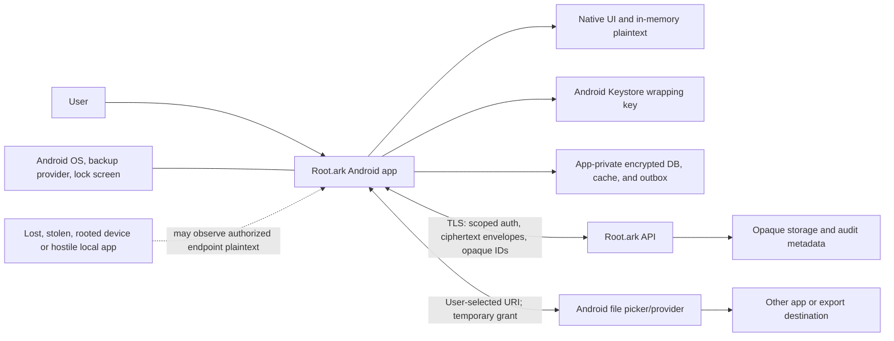

# Root.ark Android client architecture and threat model

Status: design proposal for issue [#64](https://github.com/bielxdh3/Root.ark/issues/64). The issue approves a future native Android client and this design gate only; it explicitly does not authorize implementation, app-store publication, or release.

Evidence baseline: `Root/main` / `d2ae0eb1c2fc87c1131a73c2a324c695b71664c1` (2026-10-01). Repository citations below refer to reviewed source or documents; platform references are official Android documentation. The app described here does not yet exist.

## 1. Overview and evidence boundary

### Repository facts

| Fact | Evidence and boundary |
|---|---|
| Issue #64 tracks a future product-approved Android client, but explicitly does not authorize implementation. The default-branch plan still marks a mobile client as future work. | Live [issue #64](https://github.com/bielxdh3/Root.ark/issues/64); `docs/plan-tree.md`, “Clients and protocols.” |
| No Android application module or Gradle wrapper exists in the evidence-baseline tree; the repository is a Node.js/Express application with a Node.js sync client. | Tracked repository tree at baseline; `docs/plan-tree.md`, “Clients and protocols.” |
| The approved product direction requires Android to reuse Root.ark's canonical protocol, device authorization, recovery, and cryptographic model. | `docs/OWNER_APPROVED_FEATURES_2026-09-03.md:23`. |
| Issue #65 records owner approval of the foundational Zero-Knowledge direction. Separately, the Phase 8 architecture/threat-model review accepted the contract as the baseline for bounded Phase 9 foundation work. Neither establishes runtime acceptance, Android interoperability evidence, or release approval. The contract describes current server-readable encryption and server-side preview/search as legacy behavior. | `docs/architecture/zero-knowledge-migration-contract.md:3,10-16`. |
| The accepted contract freezes the technical profile, including client-generated compartment roots by epoch, fresh file-version keys, and recipient/device-scoped wraps with authenticated scope. Android byte-for-byte compatibility and runtime behavior remain unproven. | `docs/architecture/zero-knowledge-migration-contract.md:42-46,64-80,154-162`. |
| Root.ark's Node sync protocol declares payload `protocolVersion = 2`, while `SYNC.md:72-74` still describes it as version 1. The API route path remains `/sync/v1/objects`. | `sync-client/rootark-sync-protocol.js:6,13-15,112-126`; `src/routes/sync.js:197-214`; `SYNC.md:70-77`. |
| The current sync allow-list carries `path`, `name`, `contentType`, `size`, and `sourcePath` as operation metadata. The server returns that metadata with the stored record. AEAD AAD binding authenticates these values; it does not hide them. | `sync-client/rootark-sync-protocol.js:13-15,112-126,208-239`; `src/routes/sync.js:51-68`. |
| The server rejects plaintext and `fileKey` fields and bounds ciphertext at 8 MiB per operation, but device authorization requires a configured registry or injected verifier. Production wiring sets `requireDeviceAuthorization: true`; no Android enrollment/revocation API is established by this client task. | `src/routes/sync.js:12-13,161-188`; `server.js:4508-4514`. |
| The current Node sync engine lists the remote object set and applies a `remote-wins` conflict policy. A native selective-sync or remote-only placeholder contract is not established by this baseline. | `sync-client/rootark-sync-engine.js:513-564,839-865`; the plan marks a mobile client as future work in `docs/plan-tree.md` under “Clients and protocols.” |
| The browser has encrypted local preview/index/store components. They are browser code, not an Android key store, local database, or native protocol implementation. | `public/client/rootark-protected-preview.js:7-37`; `public/client/rootark-protected-index.js:7-41`; `public/client/rootark-protected-store.js:7-53`. |

The plaintext metadata and version-documentation mismatch are protocol compatibility blockers for protected Android content. An Android client must not copy the current Node metadata schema or infer that “server-blind” means filenames are hidden. A versioned contract must specify which routing metadata can remain visible, which names and search fields are encrypted, and how both clients encode and verify them. This document records the gap; it does not change the protocol or claim a server fix.

### Proposed architecture (technical default, not owner acceptance)

| Component | Proposed responsibility |
|---|---|
| Android app | Kotlin, Jetpack Compose, AndroidX platform components, one native app with a small isolated protocol/crypto boundary. Proposed minimum API: 29. Target the latest stable SDK required by the chosen distribution channel at implementation time. |
| Protocol/crypto boundary | Implement the frozen Root.ark envelope, device authorization manifest, and sync wire contract byte-for-byte. Use a pinned, reviewed Android-compatible implementation; no app screens, storage adapters, or workers call primitives directly. |
| Device key vault | Use Android Keystore for an installation-specific, purpose-limited local wrapping key. Prefer TEE/StrongBox-backed hardware when the device supports it and record the actual security level. StrongBox is optional because availability and supported algorithms vary. |
| Local store | App-private SQLite/Room is a proposed metadata index only. Persist opaque identifiers and authenticated ciphertext/envelopes; encrypt names, paths, previews, indexes, and pending operations before persistence. Do not store content keys or recovery plaintext in database rows, preferences, worker input, logs, or crash payloads. |
| Sync scheduler | WorkManager for deferrable and retryable sync, with unique work per account/device. Workers read opaque queue IDs and re-check session, device authorization, key epoch, and expiry before each network mutation. User-selected metered-network policy is respected. |
| Root.ark API | Authenticated TLS service that enforces active device authorization, compartment scope, expiry, replay/idempotency, size limits, and revocation. It stores ciphertext and only approved minimum routing metadata for protected objects. |
| OS file providers and recipients | Explicitly selected import/export boundary. Access is granted per URI and per user action; any decrypted export leaves the Zero-Knowledge endpoint guarantee and cannot be retroactively revoked. |

API 29 is a preliminary support recommendation only. `KeyInfo.getSecurityLevel()` is available from API 31; API 29–30 expose the older `isInsideSecureHardware()` signal, which is deprecated from API 31. The implementation must classify those results conservatively, and the owner may instead raise the minimum API to 31. A minimum API does not guarantee secure hardware. If no hardware-backed local wrapping key is available, proposed default behavior is to disable persistent offline protected-content access rather than silently downgrade key storage. Confirm the minimum supported API and this fallback before implementation.

### Protocol and key-flow rules

1. **Protocol profile gate:** the repository records `rootark-zk-1` as the frozen technical profile for bounded Phase 9 foundation work. This does not establish Android interoperability or current runtime behavior. Implement the exact per-version keys, compartment/epoch scope, purpose separation, deterministic envelope/AAD, HPKE, and signed device-authorization manifest bytes. Android must reject unknown, downgraded, malformed, expired, replayed, wrong-device, wrong-compartment, wrong-object, or wrong-epoch material before decrypting or applying it. Match the Node implementation at `src/crypto/rootark-zk-1.js` and add independent Android-compatible vectors; do not label either client formally reviewed until that review occurs.
2. The protocol private keys required by the Root.ark suite may not be directly usable as Android Keystore keys on every API/device. Do not assume X25519/Ed25519 hardware operation exists. The implementation gate must verify platform support. If the reviewed provider generates protocol keys in app memory, persist only their authenticated ciphertext wrapped under the Android Keystore key; erase transient byte buffers on a best-effort basis. A rooted or process-compromised device may still invoke keys or copy plaintext.
3. Login authentication, device authorization, and possession of content keys remain separate. Password reset or administrator privilege never recovers protected content. The existing browser login sets an `HttpOnly` `rootark_session` cookie plus a CSRF cookie (`src/routes/auth.js:182-199`); this is not by itself a native-session contract. The Android HTTP layer must use a documented cookie/CSRF flow or a separately approved native auth API, never a credential in a URL, and must preserve session-version revocation and TOTP challenges. Enrollment requires approval from an already-authorized device or a verified recovery package; it selects only the intended compartments and binds public keys, device ID, epoch, expiry, and replay state.
4. **Recommended recovery default:** user-generated, password-protected, verified recovery package plus already trusted devices; no human recovery person or universal administrator key in the first version. This follows the recovery architecture recommendation in the accepted Zero-Knowledge contract, but the authority policy remains an owner decision. A new installation creates new device keys after recovery, registers them, and rotates material for future content. If all authorized devices and recovery material are lost, content remains unrecoverable.
5. Revocation blocks future server access at the next online check, revokes device authorization, and advances applicable compartment epochs. It cannot erase ciphertext, keys, plaintext, screenshots, recipient copies, or exported files already obtained by that device. Offline access therefore needs a finite, visible authorization lease; the default remains disabled until the owner approves its maximum duration and copy behavior.
6. Root.ark's current protocol-v2 metadata schema exposes names and paths. Protected Android operations must use a future approved metadata envelope or opaque identifiers, not send protected names/search terms in that schema. The Android adapter is blocked until protocol version, metadata leakage budget, device registry API, and fixtures agree across server, browser, Node client, and Android.

## 2. Threat model, trust boundaries, and assumptions

### Assets and objectives

Assets: file plaintext, per-version content keys, compartment roots, device signing/HPKE keys, recovery packages, filenames and folder structure, preview/search material, offline copies and pending changes, auth/session state, device enrollment/revocation records, sharing capabilities, and audit integrity.

Required invariants:

- The server and administrators receive no ordinary decryption path for protected content, keys, names, previews, indexes, or recovery packages.
- Device authorization and content-key authorization are scoped, expiring, revocable, replay-resistant, and separate from login.
- No sensitive plaintext or secret appears in telemetry, crash reports, notifications, clipboard previews, task-switcher screenshots, OS backups, or worker configuration.
- Protected bytes are authenticated against suite, object/version, compartment, purpose, epoch, source metadata, and recipient scope before display, indexing, export, restore, or sync.
- Offline copies and recipient exports are acknowledged as copies outside the service's immediate revocation control.
- The client fails closed on unknown protocol, integrity, key, authorization, or migration state. Network failure never falls back to a server plaintext preview.

### Trust boundaries and actors

| Boundary | Actor/data crossing | Required control | Residual limit |
|---|---|---|---|
| Android app ↔ Android OS/Keystore | Protocol keys, local wrapping operations, plaintext during use | App-scoped key with constrained purpose; use hardware-backed level where available; short plaintext lifetime; local device authentication | Keystore limits key extraction and use but a compromised OS/app process may invoke keys or read plaintext. |
| Android app ↔ Root.ark service | Session, device proof, opaque IDs, ciphertext, version and routing metadata | TLS; current session and permissions; active device registry; signature/AEAD verification; expiry, epoch, replay/idempotency, bounded payload | Service observes traffic, timing, size, account/routing fields, and any metadata left unencrypted. |
| Android app ↔ local database/cache/outbox | Encrypted keys, content cache, previews/indexes, pending operations | App-private storage; AEAD before persistence; Keystore-wrapped local key; explicit TTL/eviction; no plaintext durable queue | Rooted-device or live-process access can expose unlocked content; flash erasure is not guaranteed. |
| Android app ↔ Auto Backup/device transfer | Local settings, DB, queue, cache, tokens, device-bound material | Explicit no-backup policy for all sensitive state on legacy and current rule formats; verify both cloud and device-to-device transfer | Android documentation warns that `allowBackup=false` may not disable device-to-device transfer on some Android 12+ manufacturers; manifest flag alone is insufficient. |
| Android app ↔ picker/provider/share target | User-selected source file, destination, or decrypted export | Storage Access Framework, narrowly scoped URI grants, explicit plaintext-export confirmation; no broad file permission | A recipient or chosen provider may copy/retain exported plaintext. |
| Android app ↔ screen/clipboard/notification surface | Names, content snippets, previews, search terms | Generic notifications; protect sensitive windows; no keys/recovery in clipboard; explicit content copy with Android sensitive-clip flag where supported | Camera capture, accessibility abuse, rooted OS, and recipients may bypass app-side UI protection. |
| Android app ↔ offline scheduler/network | Encrypted work, credentials, authorization lease | Opaque worker identifiers; unique idempotent work; re-check authorization and expiry; defer on metered/low-battery constraints | Android may defer or stop work. Delivery time is not guaranteed. |

### Assumptions and non-goals

- Android-specific architecture and platform choices below are proposals pending the gates in Section 4. The frozen `rootark-zk-1` profile is a technical baseline for bounded Phase 9 foundation work, not Android compatibility evidence. Android implementation, issue #65 migration, #66 selective-sync protocol, #63 search product scope, and #68 server-blind public sharing remain separate acceptance scopes.
- The app will not claim protection against a compromised/rooted OS, malicious accessibility service, malicious app with granted export access, camera capture, or an authorized recipient who retains a copy.
- Root detection is advisory only. It is not a security boundary and must not be represented as proof that a device is safe. Owner policy may block enrollment or offline use on a known-compromised device after product impact is assessed.
- No service-worker/PWA, Node file journal, browser IndexedDB, Android backup transport, or existing server-readable preview is assumed to be a native Android security control.
- External behavior requiring Google Play, OEM backup, actual Keystore hardware, a production TLS endpoint, or a physical device remains unverified until that environment exists.

## 3. Attack surface, mitigations, and attacker stories

These are prospective design scenarios, not validated vulnerabilities in an Android app. There is no Android implementation to audit.

| Priority | Scenario and capability gain | Prerequisites | Impact | Proposed control and test evidence |
|---|---|---|---|---|
| P1 | A server, administrator, or database reader learns protected content/name through an Android request. | Client sends plaintext, key material, or current cleartext `name`/`path` metadata. | Protected content or library structure becomes server-readable. | Protocol compatibility gate: exact signed envelopes, client-side encryption, minimum opaque metadata, ciphertext-only negative tests; reject plaintext/key fields and assert server fixtures cannot recover names. Existing sync allow-list exposes names/paths (`sync-client/rootark-sync-protocol.js:13-15`). |
| P1 | A lost or stolen unlocked phone exposes decrypted cache or creates operations as an active device. | Device has valid session, offline lease, keys, cache, or pending authorization. | Access to that device's authorized compartments and local copies. | Short local-auth lease; hardware-backed wrapper when available; clearable session/cache; one-action server revocation; finite offline lease; test locked/unlocked, revoke online/offline, expiry, cache clear, reboot and re-enrollment. Already downloaded copies remain exposed until local control is regained. |
| P1 | A rooted OS or compromised app process invokes keys or captures plaintext despite non-exportable hardware keys. | Root/process/accessibility compromise while user has unlocked protected data. | Read or export the content already authorized on that endpoint. | Minimize in-memory lifetime, gate high-risk use, no plaintext logs/backups; test rooted emulator as a residual-risk demonstration. Never claim Keystore or root detection prevents live plaintext capture. |
| P1 | Replayed, stale, downgraded, or cross-compartment operation is accepted. | Attacker can replay/tamper with queued or network bytes or exploit stale authorization. | Unauthorized disclosure/write, rollback, or corrupted local state. | Exact cross-client CBOR/AAD/signature fixtures; bind operation/device/compartment/epoch/version; enforce expiry/replay/idempotency; negative vector suite for mutation, replay, wrong key/scope, downgrade, and out-of-order state. |
| P1 | A sync conflict overwrites or hides a newer change. | Two devices edit offline; current Node engine returns `remote-wins`. | Silent data loss or stale content reappears. | Android proposal retains both authenticated branches and pauses for explicit resolution; never infer deletion from local absence. Owner must approve conflict UX/authority. Test concurrent creates/updates/deletes/moves and restart at every commit boundary. |
| P1 | Android silently treats files as plaintext-protected while the current sync protocol exposes filename/path metadata. | Android reuses the current v2 metadata allow-list. | Library names and structure leak to service/log observers even if file bodies are encrypted. | Block protected Android interoperability on a versioned metadata contract; positive/negative packet captures assert protected names, search terms, and preview text are absent. |
| P2 | Auto Backup or device-to-device transfer copies device-bound state to another device or cloud. | Sensitive DB/cache/preferences/outbox are included by default or rules are incomplete. | Stale device material survives deletion or is restored without its original key context. | Explicitly disable and exclude sensitive domains in both legacy and API 31+ rule files; test cloud backup and OEM device transfer on supported releases; restored app must require re-enrollment/recovery. |
| P2 | Export/share, clipboard, screenshot, or notification discloses protected names/content. | User explicitly exports/copies, an app receives a share grant, or UI surface shows content while locked. | Third-party retention or lock-screen/history exposure. | Generic notices; `FLAG_SECURE` on protected viewer; never copy key/recovery material; sensitive clipboard flag for user-directed content copies; FileProvider URI with read-only temporary grant and narrow path; explicit export warning. Test lock screen, task switcher, screenshot, clip preview, grant expiry, and receiver retention notice. |
| P2 | Import or hostile file-provider URI abuses broad storage access or leaves plaintext temporaries. | Attacker controls a provider, path, content length, MIME, or stream behavior. | File read outside selection, app crash, plaintext residue, or resource exhaustion. | SAF user selection; validate size/MIME after reading, stream to encrypted temp, bound parsers, clean on cancel/crash recovery, no all-files permission. Test malformed, oversized, interrupted, symlink/path-like name, and duplicate URI cases. |
| P2 | Background retry duplicates a mutation or uses revoked/expired credentials. | WorkManager retries after network/app/device state changes. | Duplicate versions, stale access, resource use, or queued writes after revocation. | Unique work; persisted idempotency IDs only; worker reloads auth and verifies expiry/epoch for every attempt; cancellation; no credential/key in `WorkRequest` data. Test process death, reboot, offline/Doze, repeated enqueue, and revoked/expired task. |
| P2 | Oversized content or provider failure causes an incomplete object to be accepted as synced. | Content exceeds current 8 MiB operation limit, upload is interrupted, or platform kills the worker. | Partial/corrupt object or wasted data/battery. | Authenticated chunk/resume protocol with final manifest and explicit completion is required before large-file claims. Until that exists, reject unsupported sizes before queueing and preserve source data. Test disconnect at every chunk/commit step. |

### UX/security behavior defaults

- **Enrollment:** explain that an enrolled phone may decrypt only the chosen compartments; create device keys; show a short pairing/approval flow; require current trusted device or verified recovery package and step-up login; show active device, authorized scope, last-seen state, and revoke action.
- **Revocation:** require local confirmation and step-up; online confirmation returns an explicit state; offline revocation is visibly pending and cannot promise immediate server cutoff. Rotate future-write keys/authorization epoch. Warn that already-decrypted/offline copies cannot be recalled.
- **Locked/stale:** show only generic state until local unlock and valid device/key authorization; no filename/content previews on the lock screen, task switcher, error toast, or push payload. Clear search term and in-memory plaintext when leaving the protected view or locking.
- **Offline:** display whether content is available from the local ciphertext cache, whether its authorization lease is still valid, and whether changes are queued. No indefinite offline access or silent conflict resolution. Before an owner-approved lease exists, protected offline unlock is off by default.
- **Placeholders:** in v1 a placeholder is only an Android app row for a known opaque object with encrypted metadata. It is not an Android filesystem mount or Files On-Demand provider. Explicit hydration fetches that object, verifies ciphertext/envelope before display, and caches ciphertext only. Eviction deletes local cache only; it never sends a delete/tombstone. Do not claim selective sync until #66 provides a paginated/remote-only state contract.
- **Previews/search:** decrypt and render only in the app after local authorization; do not call server-side preview/search for protected content. Cache preview/index as authenticated encrypted artifacts bound to source version and epoch. v1 search covers only an already-unlocked local protected index; never upload a query or send terms to analytics. Full-text search remains gated by #63.
- **Import/export:** use Android's system document picker for explicit per-file access; do not request broad external-storage access. Import streams directly into client encryption. A protected file leaving the app is a separate plaintext-export action with recipient-copy warning; public/capability sharing is deferred to #68's server-blind design.
- **Screen/clipboard/notifications:** use Android's secure-window flag while a protected document is open; this only blocks supported screenshots/non-secure displays. Do not copy keys, recovery data, or search terms. If the user elects to copy document text, mark it sensitive and warn that clipboard ownership is outside Root.ark. Local and remote notifications contain no file/user/compartment names or previews; generic “sync needs attention” is sufficient.

### Acceptance and test/build matrix (future gates; not run)

| Gate | Required proof |
|---|---|
| Protocol unit/interoperability | Kotlin/JVM golden vectors match the Root.ark Node implementation at `src/crypto/rootark-zk-1.js` byte-for-byte for envelope, deterministic CBOR, AAD, HPKE info, signatures, metadata envelopes, and sync operations. Add two-way round-trip against an independent client. Negative tests: altered AAD, ciphertext/tag, wrong key/object/compartment/device/epoch, duplicate fields/IDs, unknown suite/version, stale/revoked device, replay, downgrade, expired authorization, and invalid lengths all fail closed without leaking plaintext/keys in errors. |
| Local key storage | API-floor and current-API emulator tests verify Keystore key policy; `getSecurityLevel()` on API 31+, conservative legacy hardware reporting on API 29–30, backup exclusion, biometric/device-lock behavior, key invalidation, uninstall/reinstall, and StrongBox present/absent. Physical-device evidence on at least one TEE-backed device; StrongBox-specific behavior is additional when available. Missing hardware capability invokes the approved no-offline fallback. |
| Device lifecycle/recovery | Enroll via trusted device and recovery package, restrict compartment scope, revoke, reject stale writes/reads after server contact, rotate future keys, test lost-device and lost-package states, verify recovery package before setup completes, and prove password reset does not recover content. |
| Native authentication | Exercise the selected native cookie/CSRF or native API flow, TOTP challenge and step-up enrollment, session-version revocation, secure session persistence, TLS failure, and logout cleanup. Confirm no session credential appears in URLs, worker data, logs, or crash reports. |
| Offline/sync/conflict | Network loss, process kill, reboot, Doze, metered/unmetered network, duplicate worker, expired lease, stale epoch, interrupted transfer, retry, simultaneous edit, move/delete/trash, tombstone replay, and conflict restart tests. No plaintext queue; no local absence-to-delete; both conflict branches remain recoverable. |
| Placeholder/large-file | Remote-only/metadata listing does not download content; explicit hydrate validates before decrypt; local eviction does not mutate server; integrity failure removes/locks partial cache. Test server payload bound. A chunk/resume integration test is required before enabling objects larger than the current 8 MiB encrypted-operation limit. |
| Preview/search/privacy | Supported format allow-list; wrong-version/epoch/tampered preview is not rendered; protected search uses only local encrypted index; query and result names absent from network, logs, analytics, notifications, clipboard, and crash data; cache clear on revoke/logout/expiry. |
| OS interfaces | SAF cancellation/provider failure/oversize/import tests; FileProvider or equivalent exposes only one user-selected export via read-only temporary grant; no broad storage permission; test URI injection, unauthorized URI access, grant revocation, receiver copy warning, sensitive clipboard flag, screenshot/task-switcher/lock-screen masking. |
| Backup/restore | Test Android legacy `fullBackupContent` and API 31+ `dataExtractionRules` for cloud and device transfer on supported Android/OEM matrix. No session, Keystore-bound keys, recovery secrets, plaintext, preview, index, queue, or protected cache is copied. A restored install must re-enroll or use recovery. |
| Battery/background | Worker constraints, unique-work deduplication, bounded retries, cancellation, foreground notification for long work, user metered-data preference, low-storage/backpressure, and generic notification content under manufacturer background restrictions. |
| Android build/release CI | Once Gradle project exists, pin Gradle wrapper/JDK/dependency verification and run `./gradlew --no-daemon clean lint testDebugUnitTest testDebugAndroidTest assembleRelease` on exact commit. Run unit tests at the minimum API and current supported API; instrumented tests on both emulator levels plus a physical Keystore device. Review manifest permissions, backup rules, exported components/providers, network security config/TLS, release artifact contents/signing, and generated dependency provenance. No signing secret or production credential enters CI logs/artifacts. |
| Existing server CI | Preserve the current Node contract and run `npm ci`, `npm run validate:syntax`, `npm test`, `npm run validate:artifacts`, and `npm run validate:dependencies` on the exact commit. This validates server regression compatibility only; it is not Android evidence. |
| Final acceptance | Exact-head CI green; cross-client protocol and security vectors green; no unresolved P1/high security issue; documented manual physical-device tests complete; owner gates below accepted; no release/publication inferred from a local build. |

## 4. Severity calibration and remaining gates

The priorities above are design priorities, not vulnerability findings. Severity is conditional on implementation, reachable attack path, affected compartment count, attacker privilege, and deployed controls:

| Potential severity | Prospective example | Counterexample or calibration limit |
|---|---|---|
| Critical | A shared server/admin key or protocol flaw gives an unauthenticated remote actor plaintext for every user's protected compartments. | No such Android app or production key escrow is established by this review. Do not report this as an existing finding. |
| High | A remotely reachable authorization/replay defect permits a revoked device or other user's key to read/write protected compartments at scale. | A single already-authorized user exporting their own file is expected behavior, not a server compromise. Scope the impact to affected users/compartments and required privileges. |
| Medium | A protected metadata field, search query, or device identifier is exposed to a service/log recipient beyond the approved leakage budget. | Ciphertext size, timing, or unavoidable routing metadata is not automatically a finding if the exact field is approved and documented. Current clear `name`/`path` fields still require protocol review before calling them accepted leakage. |
| Low | A generic background-activity timestamp or non-sensitive local operational state is exposed without content or account takeover. | A notification containing a filename, sensitive query, key, or preview may become higher severity based on its audience and reachability. |

### Owner decisions required before implementation

1. **Distribution and support:** approve Google Play, private distribution, or another channel; minimum supported Android version/API; support lifetime; target-device matrix. Proposed default is Kotlin/Compose, minimum API 29, latest stable target SDK at release.
2. **Offline authorization and local copies:** choose maximum offline lease, local unlock/session timeout, whether protected content may remain available while offline, and what revocation means for a device that cannot contact the server. Until approved, offline protected unlock is disabled.
3. **Recovery authority:** approve the recommended user-verified recovery package plus trusted devices, or explicitly select another policy. No recovery person or administrator key is included by default.
4. **Conflict behavior:** approve the safe retain-both/ask-user UX or another loss-safe client authority. The current Node `remote-wins` implementation is not silently adopted as mobile product policy.
5. **Protected metadata/search:** approve which names, paths, sizes, previews, and search fields the server may observe; align #63's local/advanced-search scope. Reconcile the current metadata schema with the accepted Zero-Knowledge architecture baseline.
6. **Import/export and share:** approve whether Android may create plaintext files for external apps, copy protected text, or use a server-blind link; define confirmation and recipient-copy wording. Protected public links remain dependent on #68.
7. **Notifications:** decide whether v1 needs local-only notifications or push. Any push must contain opaque, non-sensitive invalidation data only; no FCM/vendor event may identify a protected file or compartment.
8. **Offline/selective sync scope:** decide whether #64 v1 waits for #66 remote-only listing, lazy hydration, chunked/resumable transfer, and safe local eviction. Do not implement a mount/placeholder provider as part of #64 without a separate acceptance boundary.

### Platform/service gates

- Resolve API 29-floor compatibility and current target SDK against the selected release channel when implementation starts; Android target policy changes over time.
- Verify that `AndroidKeyStore` and the selected crypto library support the frozen `rootark-zk-1` profile's exact algorithms, formats, key restrictions, and recovery KDF on all supported devices. The profile is not Android interoperability evidence; produce byte-for-byte vectors before implementation acceptance. Record hardware security levels using the API-appropriate method. StrongBox must remain optional unless the owner deliberately accepts device exclusion.
- Build and test a real enrollment/revocation/device-registry API and secure deployment path. Current server wiring requires device authorization but uses a configured registry path or injected verifier; protected sync cannot enroll Android devices by itself (`server.js:4508-4514`, `src/routes/sync.js:161-188`).
- Design/version the protected metadata protocol, sync pagination/remote-only state, chunk/resume rules, and cross-client vectors before Android sync can safely claim compatibility. Current Node `protocolVersion=2` and the stale `SYNC.md` version-1 description must be reconciled.
- Validate backup exclusions across Android cloud backup, device transfer, and OEM variants; no manifest-only claim is sufficient.
- Provide the Android SDK/JDK/Gradle CI image, API 29 and current emulator images, a physical hardware-backed test device, a rooted test image, disposable server fixtures, and a production-like TLS endpoint. These are test prerequisites, not present repo capabilities.

### Official Android platform references

- [Android Keystore system](https://developer.android.com/privacy-and-security/keystore): non-exportable key material, use restrictions, hardware-backed security-level inspection, and device variation.
- [KeyInfo API reference](https://developer.android.com/reference/android/security/keystore/KeyInfo): `getSecurityLevel()` is available on API 31+; `isInsideSecureHardware()` is the legacy indicator on earlier supported versions.
- [Back up user data with Auto Backup](https://developer.android.com/identity/data/autobackup): default app-data inclusion, legacy and API 31+ rule formats, and device-to-device transfer caveat when `allowBackup=false` on some manufacturers.
- [Access documents and other files from shared storage](https://developer.android.com/training/data-storage/shared/documents-files): Storage Access Framework and user-selected URI permissions without broad storage permission.
- [Task scheduling with WorkManager](https://developer.android.com/develop/background-work/background-tasks/persistent): persistent/deferred work, constraints, retries, and process/device restarts; scheduling time is not guaranteed.
- [Secure file sharing with FileProvider](https://developer.android.com/training/secure-file-sharing/setup-sharing): content URIs and temporary recipient permissions instead of file paths.
- [WindowManager.LayoutParams.FLAG_SECURE](https://developer.android.com/reference/android/view/WindowManager.LayoutParams#FLAG_SECURE): reduces screenshot and non-secure-display capture for protected windows; not protection from rooted/live endpoint compromise.
- [Copy and paste](https://developer.android.com/develop/ui/views/touch-and-input/copy-paste): clipboard behavior and the sensitive-content flag for Android 13+ copied-content previews.

These references were checked against official Android Developers documentation on 2026-10-01. Platform behavior must be rechecked when the Android project and supported API range are selected.
